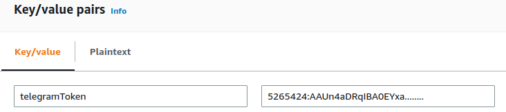
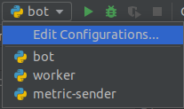

# AWS Ex1 - Provision the TelegramAI app in AWS

**Can be done in pairs (highly recommended)**.

## Background

Your goal is to provision the TelegramAI chat app as a scalable, micro-services architecture in AWS.

Here is a high level diagram of the architecture:


## Scaling the app

When end-users send a message via Telegram app (1-black), the messages are served by the Bot service (run as a Docker container in the Telegram Bot EC2 instance).
The Bot service **doesn't** download the video from YouTube itself, otherwise, all it does is sending a "job" to an SQS queue (2-black), and return the end-user a message like "your video is being downloaded...".
So, the Bot service is a very lightweight app that can serve hundreds requests per seconds. 
In the other side, there are Worker service (run as a Docker container in the Worker EC2 instance) **consumes** jobs from the SQS queue (3-black) and does the hard work - to download the video from YouTube and upload it to S3 (4-black). When the Worker done with current job, it asks the SQS queue if it has another job for him. As long as there are jobs pending in the queue, a free Worker will consume and perform the job. In such way the Bot service pushes jobs to the SQS queue, making it "full", while the Worker service consumes jobs from the queue, making it "empty".

But what if the rate in which the Bot service is pushing jobs to the queue is much higher than the rate the Worker completing jobs? In such case the queue will overflow...
To solve that, we will create multiple workers that together consume jobs from the queue. How many workers? we will deploy a dynamic model **that auto-scale the number of workers** depending on the number of messages in the queue. When there are a lot of jobs in the queue, the autoscaler will provision many workers. When there are only a few jobs in the queue, the autoscaler will provision fewer workers.
The Workers are part of an AutoScaling group, which is scaled in and out by a custom metric that the Metric Sender service (run as a Docker container in a Lambda function) writes to CloudWatch (2-blue) every 3 minutes (1-blue). CloudWatch will trigger an autoscale event (3-blue) when needed, which results in provisioning of another Worker instance, or terminate a redundant Worker instance (4-blue). 

The metric sent to CloudWatch can be called `BacklogPerInstance`, as it represents the number of jobs in the queue (jobs that was not consumed yet) per Worker instance.
For example, assuming you have 5 workers up and running, and 100 messages in the queue, thus `BacklogPerInstance` equals 20, since each Worker instance has to consume ~20 messages to get the queue empty. For more information, read [here](https://docs.aws.amazon.com/autoscaling/ec2/userguide/as-using-sqs-queue.html).

In the [TelegramAI](https://github.com/alonitac/TelegramAI) repo, review `microservices` branch. This branch contains the code for the above services, you don't need to bring your own code from the previous exercise.

### Merge the branch to your forked repo

Execute the following steps from the root directory of **your forked TelegramAI** repo.

1. Add the following Git remote under the name `upstream`:
```shell
git remote add upstream https://github.com/alonitac/TelegramAI.git
```

2. Pull the branches from the new added remote:
```shell
git pull upstream
```

3. Checkout `upstream/microservices` into a local branch `microservices`:
```shell
git checkout -b microservices upstream/microservices
```

From now on, throughout the exercise you should work on your `microservices` branch. 

### Microservices review 

1. `bot/app.py` - The Telegram bot code, similar to what you've implemented in the previous exercise. But this time, the bot doesn't download the videos itself, but sends a "job" to an SQS queue.
2. `worker/app.py` - The Worker service continuously reads messages from the SQS queue and process them, which means download the video from YouTube and store it in a dedicated S3 bucket.
3. `metric-sender/app.py` - The Metric Sender service calculate the `backlog_per_instance` metric and send it to CloudWatch.

Each service has its own Dockerfile in the root directory of the repo: `bot.Dockerfile` for the bot, `worker.Dockerfile` for the worker, and `metric-sender.Dockerfile` for the metric-sender.
For example, you can build the Metric Sender image by:
```shell
# execute from the root directory of the repo
docker build -t metric-sender:1.0 -f metric-sender.Dockerfile .
```

## Guidelines

### AWS resources

1. Create a VPC with at least 2 public subnets (no need to create a private subnet).

2. Create an S3 bucket which will store the uploaded YouTube videos.

3. Create an SQS **standard** queue. Jobs that was not processed yet should reside in the queue for a maximum period of **4 days**. The worker has a maximum period of **30 minutes** to process a single job.

4. Create a Launch Template and an AutoScaling Group. Keep the default configurations, we will change it later. The **Minimum and Desired** capacity of the ASG should be **0**.

5. Create a secret in Secret Manager containing your Telegram token. Under **Secret type** choose **Other type of secret** and enter the secret content in the following format:



6. Create a Lambda function for the Metric-sender app.
   1. In order to do so, first you need to build and push a Docker image on Elastic Container Registry (ECR). Create a private ECR.
   2. On your local machine, build the image of the Metric Sender (according to `metric-sender.Dockerfile`. It's already implemented, no need to touch) and push it to your ECR registry. In [Amazon ECR console](https://console.aws.amazon.com/ecr/repositories), select the repository that you created and choose **View push commands** to view the steps to build and push an image from your local machine to your new repository\.
   3. Create a Lambda function based on your container image.


### The Code

7. Change `common/config.json` according to your resources in AWS. This file is being used by the different services, hence it is located under `common` directory, which contains resource that are shared by the services.  

8. You are given most of the code for the Bot, Worker and Metric-sender services. In branch `microservices` complete the following *TODO*s:

   1. In `worker/app.py` complete the implementation of `process_msg()` function such that the downloaded videos will be uploaded to S3 (you can delete them from the disk afterwards).
   2. In `bot/app.py` complete `get_telegram_token_secret()` such that this function returns the value of your Telegram token.
   3. In `metric-sender/app.py` complete `lambda_handler()` such that the value of variable `backlog_per_instance` will be sent as a metric to [CloudWatch](https://boto3.amazonaws.com/v1/documentation/api/latest/guide/cw-example-metrics.html#publish-custom-metrics).

   Except the above changes, you don't need to change the code (unless you want to add more functionality to the service).

### Test your app locally

9. After you've implemented the code changes, it is good idea to test everything locally. Run the `bot/app.py` service and a single worker `worker/app.py`. Make sure that when you send a message via Telegram, the Bot service produces a message to the SQS queue, and the Worker consumes the message, downloads the YouTube video and uploads it to S3.

> Note   
> All services should be run from the root directory of the project!
> For the convenience of PyCharm users, the services run configurations already there, just choose the service and run it.   
> 

### Deploy the app in AWS 

10. As mentioned above, all services are running as a Docker containers. Implement the Dockerfiles of `bot.Dockerfile` and `worker.Dockerfile`. No need to implement `metric-sender.Dockerfile`, it's already done.
12. Deploy the Worker service to an EC2 instance
    1. Create an Amazon Linux EC2 instance.
    2. Install Docker.
    3. Get your repo code there (install Git if needed).
    4. Build the Worker image by:
       ```shell
       docker build -t worker:1.0 -f worker.Dockerfile . 
       ```
    5. Run the container such that it starts automatically when the EC2 is launches:
       ```shell
       docker run -d --name worker --restart always worker:1.0  
       ```
    6. Create an AMI from that instance and base your Launch Template on that AMI, such that when a new instance is created from the launch template, the Worker app will be up and running automatically.

11. Deploy the Bot service on a single EC2 instance (this service is not part of the autoscaling group). It should be similar to Worker deployment - in a Docker container that restarts automatically on OS reboot.

13. Use AWS cli to create a [target tracking scaling policy](https://docs.aws.amazon.com/autoscaling/ec2/userguide/as-using-sqs-queue.html#create-sqs-policies-cli) in your Autoscaling Group. `MetricName` and `Namespace` should correspond to the metric your Bot service is firing to CloudWatch. Give the `TargetValue` some value that you can test later (e.g. 10, which means if there are more than 10 messages per worker in the SQS queue, a scale up event will trigger).

14. Make sure your services are given the right IAM role permissions.

15. Test your application and make sure the autoscalig group react under load increase/decrease.

## Submission

Present you work in a personal meeting (usually 20 minutes before our bi-weekly class). **Final due date is 15/02/23**.

# Good Luck

Don't hesitate to ask any questions
