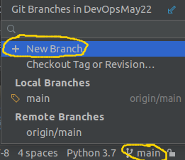
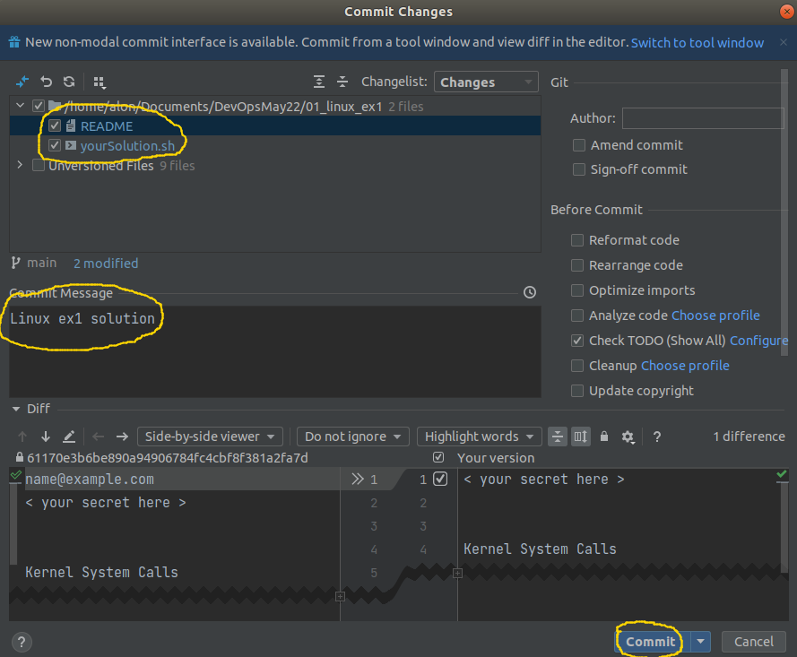

# Linux ex1
Due date: 04/07/22 23:59

## Preliminaries

1. Make sure your Pycharm terminal is configured to run Git Bash (not Powershell)
2. Open (or clone if you didn't do it yet) [our shared git repo](https://github.com/alonitac/DevOpsMay22) in PyCharm (Git -> clone...) and pull the repository  to get an up-to-date version.
3. From Pycharm button right bar, create your own git branch (Git branches will be discussed later):



Then change `<alias>` to your nickname. e.g. `linux_ex1/alonit`. The branch name must start with `linux_ex1/`


### Submission

At the end of this exercise, under `01_linux_ex1` directory in the repository, you should commit and push **only** 2 files as your solution:

- `README` file with your generated secret in the first list (see last question below), and open answers for the first two questions below, as following:
```text
< your secret here >     << secret must be in the first line!!!


Kernel System Calls
-------------------
< Your Answer >


Binary Numbers
--------------
< Your Answer >

```

- Your bash script solution in `yourSolution.sh` file (see last question below)

```shell
mkdir blabla
touch blabla
...
rm blabla
...

```

## Questions

### Kernel System Calls
(20 Points)

We've discussed in class about the Linux kernel - the main component of a Linux OS which functions as the core interface between a computer’s hardware and its processes.

But how does it work exactly? what exact commands (or **system calls**) do we pass to the kernel from programs such as `ls` or `chmod` (or any other program)?

The goal of this question is to help you become familiar with the `strace` command. strace
is a Linux command, which traces system calls and signals of a program. It is an important tool
to debug your programs in advanced cases.
In this assignment, you should follow the strace of a program in order to understand what it
does. You can assume that the program does only what you can see by using strace.
To run the program, do the following:

- Open a linux terminal in an empty directory and perform:
```shell
wget https://devops-may22.s3.eu-north-1.amazonaws.com/whatIdo
```
The `wget` command is able to retrieve data from the internet.

1. Give `whatIdo` file an execution permission (make sure you don't get Permission denied when running it).
2. Run the program using strace: `strace ./whatIdo`.
3. Follow strace output. Tip: many lines in the beginning are part of the load of the
program. The first “interesting” lines comes only at the end of the output. 

Your assignment is to supply a brief description of what the program does in the README file. Don't copy & paste the terminal output as your answer, neither explain any single command. Try to get a general idea of what this program does by observing the sys calls.


### Binary Numbers
(10 Points)

1. Convert the following binary numbers to a decimals: 
111, 100, 10110
2. What is the available decimal range represented by a 8 bits binary number?
3. Given a 9 bits binary number, suggest a method to represent a negative numbers between 0-255
4. Suggest a method to represent a floating point numbers (e.g. 12.3,  15.67, 0.231) using a 8 bits binary numbers

### Broken Symlink
(10 Points)

Uber has an automated daily backup system. Every day another backup file is created in the form `backup-<date>.obj`. e.g. `backup-13-06-2022.obj`.
To be able to restore the system from a backup copy in a convenient way,
they want to point to the last generated backup file using a static file named `backup.obj`. To do so, they create a symbolic link pointing to the last generated backup file.  

1. Let's create the daily backup file:
```shell
FILENAME=backup-$(date +"%d-%m-%Y").obj
touch $FILENAME
echo "backup data..." >> $FILENAME
```

2. Then, create a symlink (soft link) to the daily backup file:
```shell
ln -s $FILENAME backup.obj
```

Great. Now, at some point in the development lifecycle of the product,
the devops team organize all backup links in a directory `backups`. They moved the link `backup.obj` into `backups` directory:
```shell
mkdir backups
mv backup.obj backups/
```

What's wrong here? provide a fix to Uber's code. 

### File System Manipulations
(60 points)

- Open a **Linux terminal** and perform:
```shell
wget https://devops-may22.s3.eu-north-1.amazonaws.com/secretGenerator.tar.gz
```

1. Use `tar` to extract the compressed file. `cd` to *src* directory. Explore the files and their content.
                                                                                                                                                                                                                                                                                                                                                                                                                                                                                                                                                                                                                                                                                                                                                                                                                                                                                                                                                                                                                                                                                                                                                                                                                                                                                                                                                                                                                                                                                                                                                                                                                                                                                                                                                                                                                                                                                                                                                                                                                                                                                                                                                                                                                                                                                                                                                                                                                                                
2. Your goal is to generate a secret. The secret can be generated using `/bin/bash generateSecret.sh`.

3. Once you've generated it, copy it to the designated place in the README file (33 characters). 

4. Use `nano` or your preferred text editor, and **write a complete commands set** that let you generate the secret in `yourSolution.sh` file (single command in each line).
At the end, given a clean version of *src* directory (without the changes you've made) you should be able to run `/bin/bash yourSolution.sh` and the secret should be generated without any errors. 
5. Copy the content of `yourSolution.sh` into the same file in the Git repo (_01_linux_ex1/yourSolution.sh_). 
6. Commit  **ONLY** *01_linux_ex1/README* and *01_linux_ex1/yourSolution.sh* files. by:



7. Push  your changes. Your script will be checked automatically, and you will get an email with tests status.


# Good Luck

Don't hesitate to ask any questions