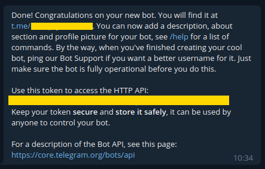

# TelegramAI Chat App

Due date: 20/10/2022 23:59  

**Can be done in pairs!**

# Background

Your goal in this exercise is to design and develop Telegram chat application which will serve YouTube content. 

## Part 1 - Create the environment

1. Fork [The TelegramAI](https://github.com/alonitac/TelegramAI.git) repo (learn about [forking a repo](https://docs.github.com/en/get-started/quickstart/fork-a-repo) in GitHub)
2. Clone your **forked repo** locally into PyCharm (Git -> Clone...)
3. [Create Python venv](https://www.jetbrains.com/help/pycharm/creating-virtual-environment.html) for the project
4. Install requirements by `pip install -r requirements.txt`

## Part 2 - Create a Telegram Bot

1. <a href="https://desktop.telegram.org/" target="_blank">Download</a> and install telegram desktop (you can use your phone app as well).
2. Once installed, follow <a href="https://core.telegram.org/bots#6-botfather">this section</a> to create a bot. You should follow until “Generating an authentication token” (not including that section)

   

At this point, you should have your own bot, as well as the API token. **Never** commit sensitive data like secrets in Git repo. For now, save the token in a file called `.telegramToken` and add this file to `.gitignore` to exclude it completely from Git index. We will later learn that the place to store sensitive data is the cloud (AWS in our case).

## Part 3 - Running a simple “echo” Bot

### The class _Bot_
Under `app.py` you are given a class called `Bot`. This class implements a simple telegram bot, as follows.  

The constructor `__init__` gets `token` arg which is the bot token you have just received from Telegram. Inside the constructor, a `TeleBot` object is created. This object is an interface to Telegram API, it allows you to conveniently receive and send messages to/from Telegram. 
The function `self._bot_internal_handler` is registered as an internal message handler. **This function is getting called whenever a new message will be sent to the bot via Telegram app.**

The default behaviour of Bot class is to “echo” the incoming messages. 
Run the program and send a message to the bot via Telegram app, observe the response and get an idea of how `_bot_internal_handler` and `handle_message` are functioning (it's recommended to run in debug mode with breakpoints).

## Part 4 - Extending the echo bot

### The class _QuoteBot_

In `app.py` you are given a class called `QuoteBot` which **inherits** from `Bot`. Upon incoming messages, this bot echoing the message while quoting the original message, unless the user is asking politely not to quote.
Run this bot and check its behavior.

## Part 5 - Build your YouTube Bot

### The class _YoutubeBot_

In `app.py` you are given a class called `YoutubeBot` which **inherits** from `Bot`, again.
Upon incoming messages, this class will take the message text, search and download corresponding YouTube video(s), the bot will then send the **YouTube video link** to the user.

1. Inside `YoutubeBot` class, override `handle_message` method and implement the functionality that is needed to download video from YouTube and send a link to the user (utilize `search_download_youtube_video` in `utils.py`).
2. Remember that by inheriting the `Bot` class, you can use all of its methods (such as `send_text`...).

### Get and store photos from the client

Use the `download_user_photo()` and optionally `is_current_msg_photo()` functions to download photos sent to the YouTubeBot app from the user.
Note that you should complete some code in `download_user_photo()` function (see `TODO` comment) so it will work correctly. 

### Cache videos (Optional)

Implement a logic that caches videos that have already been downloaded, such that it will use the local copy when user requests the same video again. 

## Part 6 - Containerize your app 

1. In your root directory of you repo, open `Dockerfile` and fill out the file such that the Bot app can be run as a Docker container.
2. Build and run the container locally, make sure it works well. 

## Submission guidelines

Create a PR from `main` branch in your forked repo into `main` branch of `alonitac/TelegramAI` (the upstream repo).   

# Good Luck

Don't hesitate to ask any questions