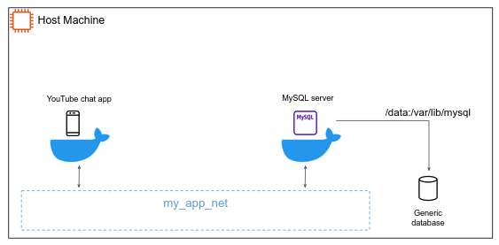

# Docker tutorials

## Get Docker

#### Windows users

[Docker Desktop](https://docs.docker.com/desktop/install/windows-install/) is an easy-to-install application for your Mac or Windows environment that enables you to build and share containerized applications and microservices.

Docker Desktop includes:

- Docker Engine
- Docker CLI client
- Docker Compose
- More...

**If you installed Docker locally on Windows**, make sure the Hyper-V and Containers features are installed and enabled:
1. Right-click the **Windows Start** button and choose **Apps and Features**.
2. Click the **Programs and Features** link (a small link on the right).
3. Click **Turn Windows features on or off**.
4. Check the **Hyper-V** and **Containers** checkboxes and click **OK**.


#### Linux users

Install [Docker Engine](https://docs.docker.com/engine/install/ubuntu/) and [Docker Compose](https://docs.docker.com/compose/install/compose-plugin/)

You may want to add your Linux user to `docker` group:
```shell
sudo usermod -a -G docker $USER
```

---

Verify Docker installed by:
```shell
docker version
```

Expect output similar to:
```text
Client: Docker Engine - Community
 Version:           20.10.14
 API version:       1.41
 Go version:        go1.16.15
 Git commit:        a224086
 Built:             Thu Mar 24 01:47:57 2022
 OS/Arch:           linux/amd64
 Context:           default
 Experimental:      true

Server: Docker Engine - Community
 Engine:
  Version:          20.10.14
  API version:      1.41 (minimum version 1.12)
  Go version:       go1.16.15
  Git commit:       87a90dc
  Built:            Thu Mar 24 01:45:46 2022
  OS/Arch:          linux/amd64
  Experimental:     false
 containerd:
  Version:          1.5.11
  GitCommit:        3df54a852345ae127d1fa3092b95168e4a88e2f8
 runc:
  Version:          1.0.3
  GitCommit:        v1.0.3-0-gf46b6ba
 docker-init:
  Version:          0.19.0
  GitCommit:        de40ad0
```

## Pull and run images

In this tutorial you will run Nginx server in a Docker container and familiarize yourself with the basic commands set of Docker.  

1. Pull the [nginx:latest](https://hub.docker.com/_/nginx/) image by:
```shell
docker pull nginx:latest
```

Most of your images will be created on top of a base image (from the [Docker Hub](https://hub.docker.com/) or another registry).
Docker Hub contains many pre-built images that you can `pull` and try without needing to define and configure your own.
To download a particular image, or set of images (i.e., a repository), use `docker pull <image-name>:<image-tag>`.

2. Run it by
```shell
docker run -p 8080:80 --name nginx-1 nginx:latest
```

The `docker run` launches a new container. 

3. Execute `docker ps`. How many containers are currently running on your system?

`docker ps` lists containers. Use with `-a` to list all containers (including stopped). It is very useful command to get the status of you running and stopped containers. 

4. List the running processes of the `nginx-1` container by: `docker top nginx-1`. How many processes are running? Where are the OS related processes upon which nginx is running (systemd, netwrokd etc...)? How could that be?
5. Stop the running Nginx container by `docker stop <container-name or container-id>`.
6. Start it again by `docker start <name or id>`
7. Kill the running container by `docker kill <name or id>`.

The `docker kill` command kills one or more running containers. Note that kill command doesn't remove the container from your system but only stop it.
In order to clean up the terminated containers use the `docker rm <name or id>` command.

7. Let's inspect the `nginx` Docker image: `docker inspect nginx`.

### Communication between containers and the internet

7. Start two different Nginx servers, as follows:
   1. Container called `nginx-1` listening of port `8080`.
   2. Container called `nginx-2` listening of port `8081`.
8. Make sure both servers are accessible from your browser.
9. Get the internal IP of `nginx-1` by `docker inspect nginx-1`.
10. Get a Shell access to `nginx-2` by `docker exec -it nginx-2 /bin/bash`.

The [`docker exec`](https://docs.docker.com/engine/reference/commandline/exec/) command allows you to run a command in a **running container**.

10. **Within `nginx-2` Shell**, install the `ping` cli tool by:
```shell
apt update && apt install iputils-ping
```

11. Try to ping the IP of `nginx-1`.
12. Try to ping `google.com`. 

## Containerizing an app

In this tutorial, we will be working with a simple Flask webserver.
The application source code in under `app`. 

In order to build the application, we need to use a `Dockerfile`. A Dockerfile is simply a text-based script of instructions that is used to create a container image.

1. In `app` directory, create a file named `Dockerfile` with the following contents:
```dockerfile
FROM python:3.8.12-slim-buster
WORKDIR /app
COPY . .
RUN pip install -r requirements.txt

CMD ["python3", "app.py"]
```

2. Open a terminal and go to the app directory with the `Dockerfile`. Now build the container image using the `docker build` command:
```shell
docker build -t my_app:0.0.1 .
```

This command used the Dockerfile to build a new container image. 
You might have noticed that a lot of “layers” were downloaded. This is because we instructed the builder that we wanted to start from the `python:3.8.12-slim-buster` image.
But, since we didn’t have that on our machine, that image needed to be downloaded.

After the image was downloaded, we copied in our application and used `pip` to install our application’s dependencies. The `CMD` directive specifies the default command to run when starting a container from this image.
Finally, the `-t` flag tags our image. Think of this simply as a human-readable name for the final image. Since we named the image `my_app:0.0.1`, we can refer to that image when we run a container.

The `.` at the end of the docker build command tells Docker that it should look for the Dockerfile in the current directory.

Now that we have an image, let’s run the application. To do so, we will use the `docker run` command.

3. Start your container by:
```shell
docker run -d -p 8080:8080 my_app:0.0.1
```
Note the `-d` which runs the container in background, releasing the CMD terminal.

4. After a few seconds, open your web browser to `http://localhost:8080`.

#### Update the application

5. Do some change to the application (edit `app.py` or `index.html`).
6. Let’s build our updated version of the image, using the same command we used before.
```shell
docker build -t my_app:0.0.2 .
```

7. Let’s start a new container using the updated code.
```shell
docker run -d -p 8080:8080 my_app:0.0.2
```

**Uh oh!** You probably saw an error from the docker daemon.
We aren’t able to start the new container because our old container is still running. It is because the container is using the host’s port 8080 and only one process on the machine (containers included) can listen to a specific port. To fix this, we need to remove the old container.

8. Remove the container:
```shell
docker ps 

# get the container id... 

docker stop <the-container-id>
docker rm <the-container-id>
```

#### Persist data using volume mounting

By default, the app stores its data in a SQLite Database at `/app/data/videos.db` in the container’s filesystem.
In case you didn’t notice, your chat videos are being wiped every time we launch the container. What can we do?

If a directory in the container is **mounted**, changes in that directory are also seen on the host machine. If we mount that same directory across container restarts, we’d see the same files.

1. Make sure you don’t have any previous `my_app` containers running.
2. Run the following command from the app directory.
```shell
docker run -p 8080:8080 -v "$(pwd)/data:/app/data" my_app:0.0.2 
```
Note the `-v "$(pwd)/data:/app/data"` which mounts the data directory from the host into the `/app/data` directory in the container.
3. Test your app and verify that the data persists.

## Multiple-container app

In general, each container should do one thing and do it well. A few reasons:

 - There’s a good chance you’d have to scale APIs and front-ends differently than databases.
 - Separate containers let you version and update versions in isolation.
 - While you may use a container for the database locally, you may want to use a managed service for the database in production. You don’t want to ship your database engine with your app then.

So, we will update our application to work like this:



So, how do we allow one container to talk to another? Networking.
**If two containers are on the same network, they can talk to each other. If they aren’t, they can’t.**

1. Create a virtual Docker network:
```shell
docker network create my_app_net
```
2. Start a MySQL container and attach it to the network. We’re also going to define a few environment variables that the database will use to initialize the database:
```shell
docker run --network my_app_net --network-alias mysql -v $(pwd)/data:/var/lib/mysql -e MYSQL_ROOT_PASSWORD=secret -e MYSQL_DATABASE=videos mysql:5.7
```
3. Verify MySql is accessible from another container. To figure it out, we’re going to make use of the [nicolaka/netshoot](https://github.com/nicolaka/netshoot) container, which ships with a lot of tools that are useful for troubleshooting or debugging networking issues.
```shell
docker run -it --network my_app_net nicolaka/netshoot
```
4. Inside the container, we’re going to use the dig command, which is a useful DNS tool. We’re going to look up the IP address for the hostname mysql.
```shell
dig mysql
```
And make sure that `mysql` is being resolved to the IP address of the container.
5. Using the above `docker build` command, build a new image from the app **located in branch `app-multi-containers`** (pick the Dockerfile from main branch if needed), run it using `docker run`. Things to notice:
   1. Both containers should run on the `my_app_net` network.
   2. Your app should listen to port `8082` in the host machine.
   3. Your app is expecting to get two environment variables (search `os.environ` in )
6. Test the app.

## Docker compose

[Docker Compose](https://docs.docker.com/compose/) is a tool that was developed to help define and share multi-container applications. With Compose, we can create a YAML file to define the services and with a single command, can spin everything up or tear it all down.
Let's deploy our app using Docker compose.

1. Make sure Docker compose is installed:
```shell
docker-compose version
```
2. At the root of the app project, create a file named `docker-compose.yaml`.
3. In the compose file, we’ll start off by defining the schema version. In most cases, it’s best to use the latest supported version.
```yaml
version: "3.7"
```
4. Next, we’ll define the list of services (or containers) we want to run as part of our application.
```yaml
version: "3.7"

services:
```

#### Define the `app` service

5. Take a look at the `docker run` command you've executed to run the Python app. Define the service entry and the image for the container accordingly:
```yaml
version: "3.7"

services:
  app:  # we can choose any name for our service
    image: <your-image-name-and-tag>
```
6. Let’s migrate the `-p 8082:8080` part of the command by defining the ports for the service.
```yaml
version: "3.7"

services:
  app:
    image: <your-image-name-and-tag>
    ports:
       - 8082:8080
```

#### Define `mysql` service

7. We will first define the new service and name it mysql so it automatically gets the network alias. We’ll go ahead and specify the image to use as well.
```yaml
version: "3.7"

services:
  app:
    # The app service definition
  mysql:
    image: mysql:5.7
```
8. Next, we’ll define the volume mapping. We need to define the volume in the top-level `volumes:` section and then specify the mountpoint in the service config.
```yaml
version: "3.7"

services:
  app:
    # The app service definition
  mysql:
    image: mysql:5.7
    volumes:
       - mysql-data:/var/lib/mysql
volumes:
   mysql-data:
```

9. Finally, we only need to specify the environment variables.
```yaml
version: "3.7"

services:
   app:
     image: <your-image-name-and-tag>
     ports:
        - 8082:8080
     environment:
        MYSQL_ROOT_PASSWORD: secret
        MYSQL_DATABASE: videos
   mysql:
    image: mysql:5.7
    volumes:
       - mysql-data:/var/lib/mysql
    environment:
       MYSQL_ROOT_PASSWORD: secret
       MYSQL_DATABASE: videos
volumes:
   mysql-data:
```

#### Run the application stack

Now that we have our `docker-compose.yaml` file, we can start it up!

10. Make sure no other copies of the app/db are running first (`docker ps` and `docker rm -f <ids>`).
11. Start up the application stack using the `docker-compose up` command.
12. When you’re ready to tear it all down, simply run `docker-compose down`.

## Security scanning

When you have built an image, it is a good practice to scan it for security vulnerabilities using the `docker scan` command. Docker has partnered with [Snyk](https://snyk.io/) to provide the vulnerability scanning service.

You must be logged in to Docker Hub to scan your images.
Run the command `docker scan --login`, and then scan your images using `docker scan <image-name>`.
