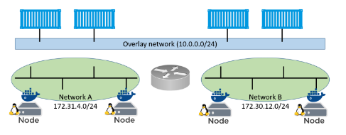

# Docker Swarm

### Create an EC2 instances for a swarm


1. In our shared AWS account, create an **Amazon Linux** EC2 instance that will be part of the swarm.
2. [Install Docker](https://docs.aws.amazon.com/AmazonECS/latest/developerguide/create-container-image.html).
3. Open relevant ports in the security group of the instance.

###  Initializing a new swarm

4. Initialize a new swarm by connecting to the manager machine and run:
```shell
docker swarm init --advertise-addr <ip>:2377
```
while `<ip>` is a public/private IP addresses or DNS of the node.

5. List the nodes in the swarm:
```shell
docker node ls
```

### Add new Managers and Workers

6. Run the `docker swarm join-token` command to extract the commands and tokens required to add new workers and managers to the swarm
7. Add new workers and managers (other nodes) to the swarm. **You should ensure that your join tokens are protected, as they are all that is required to join a node to a swarm**.

### Deploy a service to the swarm

8. Deploy a new services called `web-fe`, running 5 replicas in the swarm:
```shell
docker service create --name web-fe -p 8080:8080 --replicas 5 nigelpoulton/pluralsight-docker-ci
```
9. Inspect the service by `docker service ls`.

### Scale a service

10. Scaling up the `web-fe` service is as simple as running the docker service scale command:
```shell
docker service scale web-fe=10
```
11. Inspect the service.

### Run Swarm Visualizer app (optional)

12. Follow the README in [https://hub.docker.com/r/dockersamples/visualizer](https://hub.docker.com/r/dockersamples/visualizer).

### Removing a service

13. Removing a service is as simple as:
```shell
docker service rm web-fe
```
14. Inspect.

### Rolling update for a service

15. We’re going to deploy a new service. First, create a new overlay network for the service:
```shell
docker network create -d overlay uber-net
```

Remember that all containers on the overlay can communicate even if they are on Docker hosts plumbed into different underlay networks:



16. Verify that the network created properly and is visible on the Docker host:
```shell
docker network ls
```
The `uber-net` network was successfully created with the swarm scope and is currently only visible on manager nodes in the swarm.

17. Let’s create a new service and attach it to the network.
```shell
docker service create --name uber-svc --network uber-net -p 80:80 --replicas 12 nigelpoulton/tu-demo:v1
```

Passing the service the `-p 80:80` flag will ensure that a **swarm-wide** mapping is created. This mode is called **ingress** mode. Every node gets a mapping and can therefore redirect your request to a node that runs the service.

18. Open a web browser and point it to the IP address of the nodes in the swarm on port 80 to see the service running.

19. Now let’s assume that you want to update the app to an image tagged as `v2` instead of `v1`. We want to perform the update with **zero-downtime**, while all users can keep using the app _during the update_, without any stress on the system. We decide the following update strategy: 2 replicas at a time with a 20 second delay between each:
```shell
docker service update --image nigelpoulton/tu-demo:v2 --update-parallelism 2 --update-delay 20s uber-svc
```


